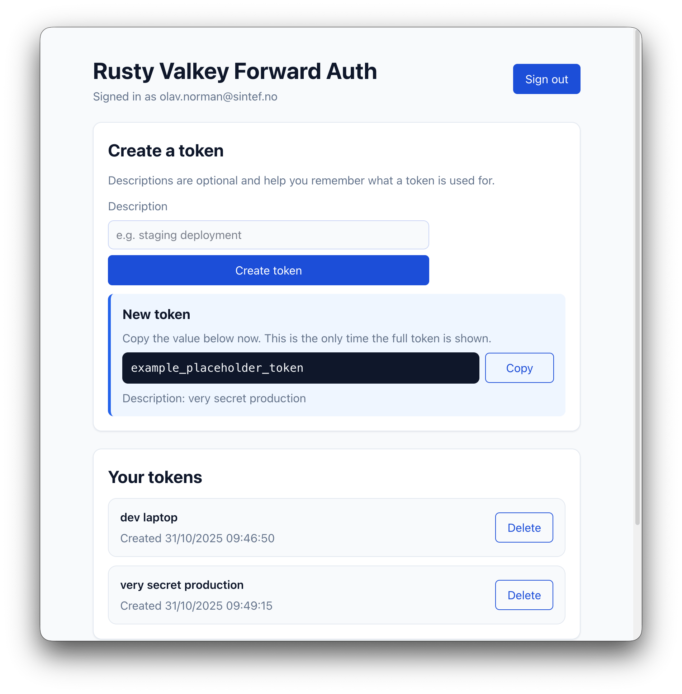

# Rusty Valkey Forward Auth

Lightweight API Key management solution. Supports OAuth2/OIDC authentication, Valkey storage, and Traefik forward auth.

Can be useful to provide an easy and old-school API key authentication mechanism to a HTTP service behind Traefik.



## Features

- **Forward Auth**: Request validation for Traefik proxy
- **Token Management API**: Create, list, and delete API tokens via OAuth2-secured APIs
- **Token Management Frontend**: Simple web UI for managing tokens, for end users.
- **Multi-user**: Supports multiple users, each with their own tokens, through OAuth2/OIDC authentication.

## Security

Static API keys are somewhat less secure than JWT or other modern authentication methods. But they are convenient and widely supported by AI tools.

This is about finding the right balance between security and usability.

Tokens are generated with a cryptographically secure random generator, and stored as salted blake3 hashes in Valkey. If Valkey is compromised, stolen hashes cannot be used to authenticate.

Notably, tokens do not expire. There is no rate limiting or brute-force protection implemented in this service. Brute-forcing 256-bit tokens is not feasible, but consider using additional protections higher up in your stack (e.g., Traefik rate limiting, WAF, etc.).

## Stack

- **Backend**: Stateless HTTP API in Rust
- **Frontend**: Web UI in TypeScript + React + Vite
- **Storage**: Valkey, a Redis fork, for token storage

## Deployment

### Kubernetes (Helm)

Add the Helm repository:

```bash
helm repo add rusty-valkey-forward-auth https://sintef.github.io/rusty-valkey-forward-auth
helm repo update
```

Generate a secure token salt:

```bash
openssl rand -hex 32
```

Install the chart:

```bash
helm install rvfa rusty-valkey-forward-auth/rusty-valkey-forward-auth \
  --set config.tokenSalt="your-64-character-hex-salt" \
  --set config.oauth.issuerUrl="https://your-oauth-provider/realms/your-realm" \
  --set config.frontend.oidcAuthority="https://your-oauth-provider/realms/your-realm" \
  --set config.frontend.oidcClientId="your-client-id"
```

For advanced configuration options, including custom values files, ingress, and resource limits, see the [Helm chart documentation](charts/rusty-valkey-forward-auth/).

## Traefik Integration

Configure Traefik to use this service for forward authentication:

```yaml
http:
  middlewares:
    rusty-valkey-auth:
      forwardAuth:
        address: "http://rusty-valkey-forward-auth:8080/forward-auth"
```

## Development

### Prerequisites

- Rust 1.90+
- Node.js 24+
- Valkey on `localhost:6379`
- An OAuth2/OIDC provider. Tested with Keycloak.

### Configuration

Create `settings.toml` or use environment variables:

```toml
# HTTP Server Configuration
address = "127.0.0.1"
port = 8080

# Valkey Configuration
valkey_url = "redis://localhost:6379"
# valkey_username = "your-username"  # Optional
# valkey_password = "your-password"  # Optional

# Token hashing salt (32 bytes hex-encoded, 64 characters)
# IMPORTANT: Keep this secret and consistent across deployments
# token_salt = "................................."  # 64 hex chars

# Static files directory (optional, defaults to frontend/dist)
# static_dir = "frontend/dist"

# CORS Configuration
[cors]
enabled = false
# allow_origins = ["http://localhost:5173"]  # Comma-separated in env: CORS_ALLOW_ORIGINS

# OAuth2/OIDC Configuration
[oauth]
issuer_url = "https://your-oauth-provider"
# OR: jwks_url = "https://your-jwks-endpoint"
# tenant_id = "your-tenant-id"  # Optional
# audiences = ["api://your-app"]  # Optional
# jwks_refresh_interval_secs = 300  # Default: 300

[oauth.claims]
subject = "sub"
groups = "groups"

[oauth.admin]
group = "admin"
# group_case_sensitive = false

# Frontend Configuration
[frontend]
oidc_authority = "https://your-oauth-provider"
oidc_client_id = "your-client-id"
# oidc_redirect_uri = "http://localhost:8080/callback"  # Optional
# api_base_url = "http://localhost:8080"  # Optional
# app_name = "Rusty Valkey Forward Auth"  # Default shown
# api_docs_path = "/docs"  # Default: /docs
# docs_html = "<p>Custom HTML docs</p>"  # Optional
# docs_html_file = "/path/to/docs.html"  # Optional
```

### Running

```bash
# Build and run
cargo run
```

The service runs on `http://localhost:8080` and serves the frontend UI at `/`.

### Setup

Install pre-commit hooks:

```bash
pre-commit install
```

### Backend

```bash
cargo check          # Validate
cargo clippy         # Lint
cargo clippy --test  # Lint tests
cargo fmt            # Format
cargo test           # Test (requires Valkey on localhost:6379)
```

### Frontend

Build frontend before running the service:

```bash
cd frontend
npm install
npm run build
```

Or run dev server separately:

```bash
npm run dev      # Dev server on http://localhost:5173
npm run lint     # Linting
```

Set `VITE_API_BASE_URL` to point to your backend API (defaults to `http://localhost:8080`).

## Endpoints

- `/` - Frontend UI (OAuth2 secured)
- `/docs` - API documentation

### API Admin Endpoints (requires admin group)

- `POST /api/users/{sub}/tokens` - Create token for user
- `GET /api/users/{sub}/tokens` - List user tokens
- `DELETE /api/users/{sub}/tokens/{id}` - Delete user token

### API User Endpoints (authenticated)

- `GET /api/me/tokens` - List own tokens
- `POST /api/me/tokens` - Create own token
- `DELETE /api/me/tokens/{id}` - Delete own token

### API Service Endpoints

- `GET /health/live` - Liveness probe
- `GET /health/ready` - Readiness probe
- `GET /forward-auth` - Forward auth validator

## Testing API Keys

```bash
curl "http://localhost:8080/forward-auth"
# should return 401 Unauthorized

curl "http://localhost:8080/forward-auth" \
     -H "Authorization: Bearer ..."
# should return 204 No Content if the key is valid
```

## License

This project is licensed under the [Apache License 2.0](LICENSE).
